# fable-5-hunter

> *"Hunting Fable 5, so you don't have to."*

[](LICENSE)
[](https://www.python.org/)
[](#)

A lightweight watcher that monitors the Claude Code CLI around the clock for
**Claude Fable 5** to become available again, and sends you a notification the
very moment it is back — across all your devices.

---

## The Fable 5 Story

| Date | Event |
|---|---|
| **2026-06-09** | Anthropic releases **Claude Fable 5** (Mythos-class): the most capable publicly available model, exceptional at software engineering, science and vision. Available on Claude API, Amazon Bedrock, GitHub Copilot and Claude Code. |
| **2026-06-12** | The US government issues an export-control directive. Anthropic suspends access for **all users** worldwide. Anthropic publicly disagrees and is "working to restore access as soon as possible" — **no timeline given**. |
| **Today** | Fable 5 is down everywhere. Thousands of Claude Code users are waiting. This hunter tells you the second it is back. |

Source: [Anthropic — Fable 5 & Mythos 5 Status](https://www.anthropic.com/news/fable-mythos-access)

---

## How detection works

The hunter talks directly to the model using the Claude Code CLI you already have — no API key required:

```bash
claude -p "<unique token>" --model claude-fable-5
```

| State | Exit code | Output |
|---|---|---|
| **Unavailable** (current) | `1` | `Claude Fable 5 is currently unavailable. Learn more: …` |
| **Available** (target) | `0` | the model echoes the unique token back |

**Available** is only declared when the unique token appears in `stdout` **and** the exit code is `0`. This makes false positives from error messages or fallback models impossible.

> **Important:** The model ID must be exactly `claude-fable-5`. A typo like `claude-fabel-5`
> produces the same "unavailable" error — and the hunter would never fire. The default is set
> correctly, so just leave `model_id` unchanged unless Anthropic publishes an alias.

---

## Quick start

```bash
# 1. One-shot check (prints status, exits 0/1/2)
python fable_hunter.py check

# 2. Test notifications (fires all active channels)
python fable_hunter.py test-notify

# 3. Start as a persistent daemon (checks every 30 min, daily heartbeat)
python fable_hunter.py run
```

**Zero dependencies** — Python standard library only (Python >= 3.9).
No `pip install`, no virtual environment needed.

---

## Test mode

Before relying on the hunter, run the **self-test** to confirm that both the
detection trigger *and* every configured delivery channel work:

```bash
python fable_hunter.py --test    # or: python fable_hunter.py test
```

This does two things:

1. Runs the real detection once (`check_fable5`) and prints the current status.
2. Sends a clearly marked **TEST** notification through **all** configured
   notifiers (telegram, discord, ntfy, desktop, file). The message contains the
   real "HOORAY, IT'S BACK!" alert text, prefixed with `TEST -- ` and a
   `(delivery test only)` note — so you see exactly what the real alert will
   look like, and confirm a TEST message arrives on every channel.

Per-channel `OK` / `FAILED` is printed. Exit code is `0` if at least one channel
delivered, otherwise `1`.

---

## Notifications

All active notifiers fire for every alert. The "HOORAY" notification is only
considered **delivered** once at least one channel returns success — guaranteeing
you will not miss the moment. If no channel gets through, the hunter retries
quickly (`alert_retry_seconds`, default 60s) without spamming on success.

| Notifier | Setup required | Best for |
|---|---|---|
| `desktop` | None — works out of the box | Windows Toast / macOS / Linux `notify-send` |
| `file` | None — last-resort fallback | Writes `FABLE5_IS_BACK.txt` to your Desktop |
| `telegram` | Bot token + chat ID | Push to phone via Telegram (recommended) |
| `discord` | Webhook URL | Discord channel or DM |
| `ntfy` | Pick a topic name | Lowest barrier: no account, free push via ntfy app |

**Default** (`["desktop", "file"]`) works for 100 % of users without any configuration.
Add `telegram`, `discord` or `ntfy` to `notifiers` in your `config.json` to reach your phone.

> **Pro tip:** Telegram and Discord reach your phone even when your computer is off.
> If you run the hunter on an always-on machine (e.g. a home server or Mac Studio),
> these channels ensure you get the alert no matter where you are.

A **single-instance lock** (`~/.config/fable5hunter/hunter.lock`, heartbeat-based)
prevents a second accidental start from sending a duplicate alert.

### Setting up Telegram

1. Open Telegram, search for **@BotFather**, create a new bot → copy the token.
2. Send any message to your new bot, then visit:
   `https://api.telegram.org/bot<TOKEN>/getUpdates` → note the `chat.id`.
3. Either add them to `config.json` under `"telegram"` or set environment variables
   `TELEGRAM_BOT_TOKEN` / `TELEGRAM_OWNER_ID`.

### Setting up ntfy (easiest mobile push)

1. Install the [ntfy app](https://ntfy.sh) on your phone.
2. Subscribe to any unique topic name (e.g. `fable5-myname`).
3. Set `"ntfy": {"topic": "fable5-myname"}` in `config.json` and add `"ntfy"` to `"notifiers"`.

---

## Autostart (24/7, survives reboot)

**Windows** (no administrator rights needed):
```powershell
powershell -ExecutionPolicy Bypass -File install\install_windows.ps1
```
Registers the Task Scheduler task `Fable5Hunter` (start at login, restart on crash, hidden).
Remove: add `-Uninstall` to the command above.

**macOS:**
```bash
bash install/install_macos.sh
```
Creates the LaunchAgent `com.fable5hunter.agent` (RunAtLoad + KeepAlive).
Remove: `bash install/install_macos.sh --uninstall`.

---

## Configuration

Copy `config.example.json` to `config.json` and adjust as needed.

Search order: `$FABLE5_CONFIG` env var → `./config.json` → `~/.config/fable5hunter/config.json`.

| Key | Default | Description |
|---|---|---|
| `model_id` | `claude-fable-5` | Model ID to check |
| `check_interval_minutes` | `30` | Polling interval while unavailable |
| `post_found_interval_minutes` | `360` | Slower interval after detection |
| `claude_timeout_seconds` | `120` | Timeout per `claude` call |
| `notifiers` | `["desktop","file"]` | Active notification channels |
| `alert_retry_seconds` | `60` | Retry interval when no channel gets through |
| `lang` | `"en"` | UI language: `"en"`, `"de"`, `"es"`, `"zh"`, `"ja"`, `"ru"`, `"auto"` |
| `telegram.bot_token` | `""` | Telegram bot token |
| `telegram.owner_id` | `""` | Telegram chat ID |
| `discord.webhook_url` | `""` | Discord webhook URL |
| `ntfy.topic` | `""` | ntfy topic name |
| `ntfy.server` | `"https://ntfy.sh"` | ntfy server (default: public ntfy.sh) |
| `messages.*` | *(locale file)* | Override built-in notification texts |

State (detection result, last heartbeat date) is stored in `~/.config/fable5hunter/state.json`.

---

## Internationalization

Built-in messages ship in six languages: **English** (`en`, default), **German** (`de`),
**Spanish** (`es`), **Chinese** (`zh`), **Japanese** (`ja`) and **Russian** (`ru`).
Set e.g. `"lang": "de"` in `config.json`, or `"lang": "auto"` to detect from the OS locale.

Additional languages can be added by placing a `locales/<lang>.json` file next to the script
(see `locales/en.json` for the key reference). Override individual messages at any time via
`cfg.messages.*` without touching locale files.

---

## Behaviour at a glance

- **First run:** sends an immediate heartbeat ("the hunter is watching") so you know it started.
- **While unavailable:** one heartbeat per day, no spam.
- **When found:** "HOORAY, IT'S BACK!" fires once across all active channels. Guaranteed delivery.
- **If it disappears again:** automatically resumes hunting and notifies you.

---

## Exit codes (`check` command)

| Exit code | Meaning |
|---|---|
| `0` | Available |
| `1` | Unavailable |
| `2` | Error (e.g. `claude` CLI not found) |

---

## License

MIT — see [LICENSE](LICENSE).  
Copyright 2026 Lukas Geiger.
